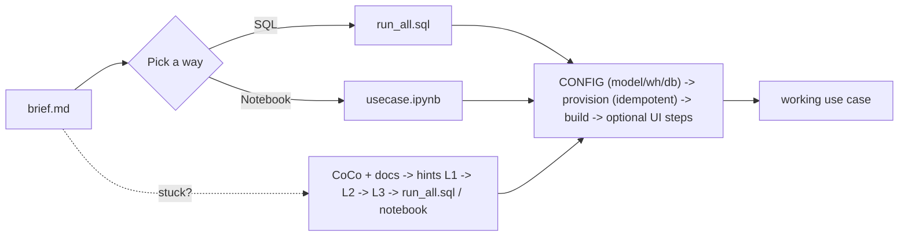

# ANWB AI Hackathon

A self-service kit for building a working GenAI app on Snowflake in a day. Two independent
challenges; each is a self-contained folder you can run **two ways** — a single `run_all.sql`
(SQL) or a notebook — with everything (data, tools, hints, the finished use case) in one place.

New here? Go to **[START_HERE.md](START_HERE.md)**.

## Architecture

```mermaid
flowchart TB
    Root["snowflake-anwb-ai-hackathon (repo)"]
    Root --> SH["START_HERE.md (front door)"]
    Root --> PF["preflight_check.sql (optional, EU-aware readiness)"]
    Root --> FR["facilitator/runbook.md"]
    Root --> C1
    Root --> C2

    subgraph C1 [challenges/01-reisnogwijzer]
      direction TB
      C1a["brief.md - what to build"]
      C1b["run_all.sql - SQL way"]
      C1c["reisnogwijzer.ipynb - notebook way"]
      C1d["hints/ level-1 level-2 level-3"]
      C1e["data/ · tools/ · app.py"]
    end

    subgraph C2 [challenges/02-marketing-agent]
      direction TB
      C2a["brief.md - what to build"]
      C2b["run_all.sql - SQL way"]
      C2c["marketing_agent.ipynb - notebook way"]
      C2d["hints/ level-1 level-2 level-3"]
      C2e["data/ · tools/ · app.py"]
    end
```



Each challenge is **independent** (no cross-dependency) and **self-contained**: both the SQL and
the notebook provision everything the use case needs and then build it. There is no separate
setup step and no shared central provisioning.

## How one challenge runs



- **One CONFIG block** per challenge (top of `run_all.sql`, first cell of the notebook) is the
  only place to set model / warehouse / database. Default model: `mistral-large2` (EU-native).
- **Idempotent + isolated:** all DDL is `CREATE ... IF NOT EXISTS` / per-challenge schema, so many
  people can run against one account safely, or set `hb_db` for a private copy.
- **Load either way:** paste `run_all.sql` in a Snowsight worksheet (Run All) or `snow sql -f`;
  import the `.ipynb` in Snowsight or push via `snow notebook`.

## The two challenges

| Challenge | Use case | Folder |
|---|---|---|
| **ReisNogWijzer** | AI travel assistant — RAG over travel/camping knowledge + tools (vehicle, weather, advisories). | [`challenges/01-reisnogwijzer/`](challenges/01-reisnogwijzer/) |
| **Marketing Agent** | Multi-step agent — turns a product + audience into a campaign plan and a presentation deck. | [`challenges/02-marketing-agent/`](challenges/02-marketing-agent/) |

## Repository layout

```
START_HERE.md              Front door: pick a challenge, pick SQL or notebook, go.
preflight_check.sql        Optional read-only account readiness check (run as ACCOUNTADMIN).
facilitator/runbook.md     Run-of-show, provisioning notes, cleanup.
challenges/
  01-reisnogwijzer/        brief.md · run_all.sql · reisnogwijzer.ipynb · hints/ · data/ · tools/ · app.py
  02-marketing-agent/      brief.md · run_all.sql · marketing_agent.ipynb · hints/ · data/ · tools/ · app.py
```

## Requirements

- A Snowflake account with **Cortex AI** enabled (Cortex Search, AI functions). EU-only
  cross-region inference is supported; the default model `mistral-large2` is EU-native.
- A role that can create a database, warehouse, and schema (or an admin who pre-creates a shared
  `hb_db`). The optional live tools / `.pptx` deck need `CREATE INTEGRATION` / Anaconda enabled;
  both degrade gracefully if not available.

Sample data is synthetic, shaped to mirror ANWB's real datasets. No API keys required.
