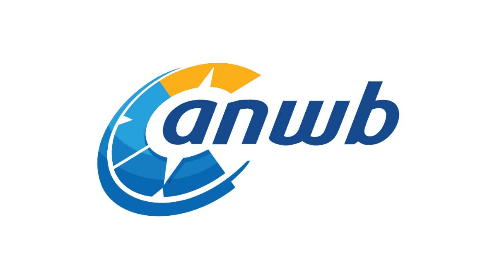

<p align="center">
  
  &nbsp;&nbsp;&nbsp;<b>&times;</b>&nbsp;&nbsp;&nbsp;
  
</p>

<h1 align="center">ANWB AI Hackathon</h1>

<p align="center">
  Build a working GenAI app on Snowflake in a day.<br>
  Two self-contained use cases — everything you need to run each one is inside its challenge folder.
</p>

## Repository layout

```
README.md                  This guide: how to run + what's being evaluated.
AGENTS.md                  Project context for Cortex Code (CoCo) — auto-loaded in a Workspace.
preflight_check.sql        Optional read-only account readiness check (run as ACCOUNTADMIN).
capability_tour.sql        Optional runnable tour of Cortex capabilities beyond the two use cases.
.snowflake/cortex/skills/  Optional CoCo skills: /reisnogwijzer and /marketing-agent.
assets/                    Logos used in this README (ANWB, Snowflake).
challenges/
  01-reisnogwijzer/        reisnogwijzer.sql · reisnogwijzer.ipynb · app.py · tools/real_tools.sql
  02-marketing-agent/      marketing_agent.sql · marketing_agent.ipynb · app.py
```

Each challenge is independent and self-contained. General hackathon info lives here in the README;
the detailed, step-by-step build for each use case lives in its own folder — in two forms, SQL and
notebook.

## The two use cases

| Use case | What you build | Folder |
|---|---|---|
| **ReisNogWijzer** | An AI travel assistant: RAG over travel/camping knowledge + tools (vehicle, weather, advisories) that answers real trip questions. | [`challenges/01-reisnogwijzer/`](challenges/01-reisnogwijzer/) |
| **Marketing Agent** | A multi-step agent that turns a product + audience into a campaign plan **and** a presentation deck. | [`challenges/02-marketing-agent/`](challenges/02-marketing-agent/) |

## How to run

1. **Pick a use case** and open its folder.
2. **Run it — Option A or B (same result, pick whichever you prefer):**
   - **Option A — SQL:** paste the challenge's `<usecase>.sql` (e.g. `reisnogwijzer.sql`) into a Snowsight worksheet → **Run All** (or `snow sql -c <conn> -f challenges/01-reisnogwijzer/reisnogwijzer.sql`).
   - **Option B — Notebook:** import the challenge's `<usecase>.ipynb` into Snowsight → pick a warehouse + database → **Run All**.
   Both provision everything (idempotent — no separate setup step) and build the use case.
3. **Then follow the "SNOWSIGHT STEPS"** at the bottom of the `.sql` file (or the last notebook cell)
   — a step-by-step, click-by-click guide to build the Cortex Agent and, optionally, ship the
   Streamlit app and inspect AI Observability. Each file is fully self-guiding; you don't need any
   other document.

### Option C (optional) — build with Cortex Code (CoCo)

Prefer an AI copilot? You can build either challenge conversationally with **Cortex Code (CoCo)** in
Snowsight. **This is optional.** If you can't or don't want to enable cross-region inference, use
Option A or B above — they run entirely on the EU-native `mistral-large2`, in region, and give
the identical result.

**Prerequisites**
- Your role needs the `SNOWFLAKE.COPILOT_USER` database role plus `SNOWFLAKE.CORTEX_USER` (or
  `CORTEX_AGENT_USER`). ACCOUNTADMIN already has these.
- Cross-region inference must be enabled — CoCo itself runs on Claude / GPT models. If your account is
  EU-only for data residency, enabling this sends CoCo's context to non-EU models; only do so if that's
  acceptable, otherwise use Option A/B.

**Steps**
1. Open this repo as a Snowsight **Workspace** (`Projects > Workspaces` — from Git, or upload the folder).
2. Open the **CoCo** panel (icon, lower-right). `AGENTS.md` at the repo root loads automatically as context.
3. Type `/` and pick **`/reisnogwijzer`** or **`/marketing-agent`** — the skill runs and explains the
   provisioning, verifies it, then walks you through building the Cortex Agent. (If the skills don't
   appear, use *Upload Skill Folder(s)* on `.snowflake/cortex/skills/`.)

Or just ask in your own words, e.g. *"Run the ReisNogWijzer challenge end to end, then walk me through
building the agent"* or *"Explain what reisnogwijzer.sql does before we run it."*

## What ANWB is evaluating (and how each use case maps)

ANWB's "Capabilities to test for GenAI" list groups into **11 capability areas** (Governance / IAM /
RBAC sits inside *Overall*; the no-code agent builder inside *Agent runtime*). The two use cases build
the core areas; the optional [`capability_tour.sql`](capability_tour.sql) adds hands-on snippets for
the rest — so **together they give every area a touchpoint**. Everything runs on Snowflake Cortex, the
platform being assessed. (Separately, [`preflight_check.sql`](preflight_check.sql) confirms each is
enabled in your account.)

| Capability area | Snowflake capability | ReisNogWijzer | Marketing Agent | Capability tour |
|---|---|:---:|:---:|:---:|
| Overall (platform, governance/RBAC, ops) | RBAC, ACCOUNT_USAGE | ● | ● | |
| LLM Gateway (model calls, compare models) | AI_COMPLETE, model choice | ● | ● | |
| RAG (knowledge base search) | Cortex Search; AI_EMBED + cosine similarity | ● | ● | ✓ embed + similarity |
| Agent runtime (multi-step orchestration) | Cortex Agents | ● | ● | |
| Tool registry (custom tools / functions) | SQL UDFs wired to the agent | ● (vehicle, weather, advisory) | ● (deck generator) | |
| Agent registry (build as a Cortex Agent) | Cortex Agent object | ● | ● | |
| Tracing (traces, cost, latency) | AI Observability; ACCOUNT_USAGE | ● | ● | ✓ usage/cost query |
| Prompt management (structured / versioned prompts) | structured prompt; Git for versioning | ○ | ● (structured plan) | |
| Evaluation (judge answer quality) | LLM-as-judge via AI_COMPLETE | ○ | ○ | ✓ |
| Guardrails (PII redaction, scope, safety) | Cortex Guard, AI_REDACT | ○ | ○ | ✓ (cross-region) |
| Skill registry (reusable AI functions) | AISQL: AI_CLASSIFY/FILTER/SENTIMENT/TRANSLATE/EXTRACT/SUMMARIZE | ○ | ○ | ✓ |

● = built into the use case  ·  ○ = available as a stretch  ·  ✓ = hands-on snippet in `capability_tour.sql`

## Good to know

- **Config in one place:** model / warehouse / database are set in a single **CONFIG block** at the
  top of the `.sql` file (and the first notebook cell). Default model `mistral-large2` (EU-native);
  alternative `llama3.3-70b`. *US-only models (Claude, OpenAI GPT, llama4-maverick) aren't reachable
  under EU-only cross-region inference.*
- **Sharing one account?** Set `db` to your own name (e.g. `ANWB_AI_HACKATHON_MSA`) in the CONFIG
  block for a private copy — otherwise runs don't collide (idempotent, per-challenge schema).
- **Your account needs:** Cortex AI enabled (EU-only cross-region is fine), Enterprise edition, and
  a role that can create a database / warehouse / schema. The optional live tools / `.pptx` deck
  need `CREATE INTEGRATION` / Anaconda — both degrade gracefully if not available.
- **PowerPoint (`.pptx`) in Challenge 2:** the HTML deck is the default and works with no setup. A
  real `.pptx` needs the `python-pptx` package — an admin accepts the Anaconda terms once
  (Snowsight → Admin → Billing & Terms). Without it, the deck step falls back to HTML automatically.
- **Preflight (optional):** run [`preflight_check.sql`](preflight_check.sql) once as `ACCOUNTADMIN`.
  It's read-only; any `FAIL` prints a one-line fix (admin-level items go to your account admin).
- **Your demo:** problem statement → architecture → Snowflake capabilities used → live demo →
  lessons learned (15 min + Q&A).
- **When you're done:** `DROP DATABASE IF EXISTS ANWB_AI_HACKATHON;` and `DROP WAREHOUSE IF EXISTS ANWB_AI_HACKATHON_WH;` (or your own `db`).
- **No API keys needed;** sample data is synthetic, shaped to mirror ANWB's real datasets. It's a
  sandbox — build and break things.
